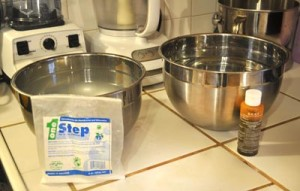
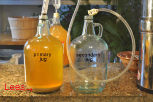
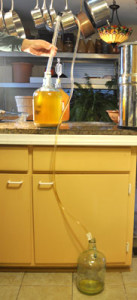
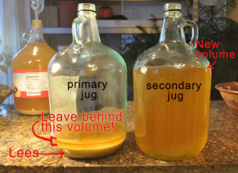
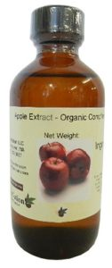
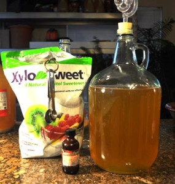
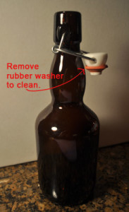

Now that you have made actual hard cider, it is time to ‘rack’ the cider into another jug for “secondary” fermentation. At this point, your cider is either almost still (exhausted carb method) OR absolutely still (back-carb, or still cider methods). Either way, it is time to say goodbye to all of the sediment nasty that is in the bottom of your jug. This sediment is called “lees” and it is all of the fruit solids and bitter tasting dead yeast left over from fermentation. To get sparkling clear cider into your bottles, we need to leave the lees behind by moving the cider to a clean jug. For those of you with a [hydrometer](http://www.amazon.com/gp/product/B000E60U6Y/ref=as_li_tl?ie=UTF8&camp=1789&creative=390957&creativeASIN=B000E60U6Y&linkCode=as2&tag=howtomakeha07-20&linkId=BU23FO2DTVMISCKV), this step is done at 1.005 S.G.. Some folks have written in wanting to leave it in primary longer, but I feel the risk of the dead yeast adding off flavors it too great. Don’t worry, you can let it keep fermenting in secondary, we just need to get the brew off the lees so that it does not impact the flavor.

## Secondary Fermentation for your hard cider, step by step:

Racking is a bit tricky the first few times you try it, and it is easy to make a mess!

Read through the whole procedure before you begin. Here is the equipment you will need for racking:

1.  Your jug of hard cider.
2.  A second, clean sterile and empty glass [jug](http://www.amazon.com/gp/product/B0064O8Z76/ref=as_li_tl?ie=UTF8&camp=1789&creative=390957&creativeASIN=B0064O8Z76&linkCode=as2&tag=howtomakeha07-20&linkId=SUC7UPX2FBIKFMAV) (this is your ‘secondary’ jug) or clean sterile food grade plastic pail. Again, I recommend clear glass over brown so that you can _see_ the brew and the sediment.
3.  4-6 feet of food grade tubing. ([10 feet \$8 ships free from Amazon.com.](http://www.amazon.com/gp/product/B000E62TCC/ref=as_li_tl?ie=UTF8&camp=1789&creative=9325&creativeASIN=B000E62TCC&linkCode=as2&tag=howtomakeha07-20&linkId=2NBMFN5MRCTTRAVR))
4.  Optional: A lock for the end of the tubing so that you can stop the flow without loosing suction. ([\$7 on Amazon,](http://www.amazon.com/gp/product/B007VFBLNC/ref=as_li_tl?ie=UTF8&camp=1789&creative=9325&creativeASIN=B007VFBLNC&linkCode=as2&tag=howtomakeha07-20&linkId=DA6BNYZ4PKODFC2L)saves a big mess)
5.  Optional: An [Auto-Siphon tool](http://www.amazon.com/gp/product/B0064ODELI/ref=as_li_tl?ie=UTF8&camp=1789&creative=9325&creativeASIN=B0064ODELI&linkCode=as2&tag=howtomakeha07-20&linkId=VVNEYYZLFVNL6P3Z) from the brew store (_really_ worth it if you have the \$9 bucks to spare).

    

**Step 1.** Clean and sterilize all of your equipment. I recommend getting 2 very large mixing bowls out for this process. First, wash your empty 1-gallon glass secondary jug with clean hot water and soap, and rinse well. Then fill the jug half way up with hot water, and add your ‘no rinse’ cleaning solution (I like “[PBW” by Five Star](http://www.amazon.com/gp/product/B0064O7XBA/ref=as_li_tl?ie=UTF8&camp=1789&creative=390957&creativeASIN=B0064O7XBA&linkCode=as2&tag=howtomakeha07-20&linkId=DMICFXLHUMU5HCZT)). Mix according to the directions on the bag, and shake the jug up to dissolve. Fill the jug the rest of the way up with hot water, and let it sit for a few minutes. Then pour this cleaner solution into the first large mixing bowl. Shake the jug gently to get all the excess water out. If you are worried about residue, rinse it out with a small amount of bottled or boiled water.

Next, fill the empty secondary jug half way up with hot water, and measure just under 1/4 oz Star-San solution ([\$10 for 4oz on Amazon with free shipping](http://www.amazon.com/gp/product/B00E5MXGKK/ref=as_li_tl?ie=UTF8&camp=1789&creative=9325&creativeASIN=B00E5MXGKK&linkCode=as2&tag=howtomakeha07-20&linkId=24MMXTA5VCF5W7QE)) for your gallon jug. Please, don’t guess on this measurement! Fill the jug up the rest of the way with hot water and let sit for 5 min. to let the kill everything. Meanwhile, get out your food grade hose and soak it for a bit in the mixing bowl with the cleaning solution. After the Star-San has been in the jug for ~5 minutes, pour the Star-San water from the jug into the second big mixing bowl, and move the hose into the Star-San to soak about 5 min. Don’t leave the hose in the bowl too long (hours) or it will get slimy. When you pour out the star-San, do it slowly and don’t let the solution-water “glug-glug” when you pour, or it will make very persistent bubbles. Save a little solution so that you can add some back into the jug to do a bubble swish-out if need be. Let the jugs drain upside down for a while to empty as much solution as possible. If you must rinse (I do, as a soap-a-phobe) use a small amount of bottled or boiled water to swish and rinse. Your “just-finished-its-cleaning-cycle” dishwasher is a fairly sterile place to drain a jug. Questions? Review [Clean and Sterile](sterile.html) here.

    

**Step 2.** Set up the jugs for racking. Here is where the fun of racking (and potentially the mess) comes in. Here is a photo of the equipment you will need. The “primary” jug is the one that currently has the hard cider in it. The lees (sediment) in the bottom is what you will want to leave in the jug as you transfer the cider to the clean “secondary” jug. The [food grade hose](http://www.amazon.com/gp/product/B000E62TCC/ref=as_li_tl?ie=UTF8&camp=1789&creative=9325&creativeASIN=B000E62TCC&linkCode=as2&tag=howtomakeha07-20&linkId=2NBMFN5MRCTTRAVR) is the key to moving the cider without lifting the jug to pour it (which obviously would stir up the bottom!). To get the cider to move through the hose, we are going to need to start a siphon (sometimes spelled siphon) that will move the cider via gravity. To coax gravity onto our team, we are going to leave the primary jug with the cider on the countertop, and move the sterile empty secondary jug under it on the floor, like in the photo on the left below:

    

If you do not have an [auto-siphon](http://www.amazon.com/gp/product/B0064ODELI/ref=as_li_tl?ie=UTF8&camp=1789&creative=9325&creativeASIN=B0064ODELI&linkCode=as2&tag=howtomakeha07-20&linkId=VVNEYYZLFVNL6P3Z) starter (as seen in the photo to the left), stop right now and buy one. They are wonderful tools, and if you plan to rack more than about 3 gallons of brew in your lifetime, they are well worth the \$9 bucks. An auto-siphon is simply a plastic tube in a sleeve with a washer that you attach to your food-grade tubing. To start a siphon with an auto-siphon, you simply give the inner tube a little pump–and BLAM-O! You have a perfect, air-free siphon flowing. It is a thing of beauty. It will make you smile. _[Click the photo to the left](http://new.midwestsupplies.com/5-16-auto-siphon.html) to read about the Fermtech auto siphon._

If you don’t have time or money to buy an auto-siphon, or you are just getting started brewing, we are going to have to start a siphon the old fashioned way—by priming the hose. For anyone who has had to transfer gas out of a car tank (or water out of a fish tank or waterbed), this should be pretty easy. If you have never done either before, you might need to get someone who owns fish to show you how. Before you try it with your precious brew, please try it with just plain water! You could try siphoning the Star San water into your bowl. It will really help to practice. I promise on the first try you will make a bit of a spill. Also, having a friend’s extra hands for this process makes it much more fun. Here are the basics on priming a siphon according to [Bodensatz Brewing](http://www.bodensatz.com/) [[5](links.html)]

-   “You need to ‘prime’ your siphon (the food grade tubing hose). All this means is that for your siphon to flow, your hose must be filled with liquid. That can be water, beer or just about any liquid at all.
-   It works by gravity. That’s right, simple gravity drives a siphon. As long as the hose is full, and the ‘source’ end of the hose is elevated higher than the ‘destination’ end, then the liquid will flow through it. Also, the greater the elevation between source and destination, the faster the siphon will flow.
-   The only parts of the hose that matter to the siphon are the source and destination ends. The hose in between can whirl and curl any and every which way, and it does not affect the siphon in the least. It can go up to the ceiling, then down into the basement, and back up again. As long as your destination end of the hose is lower than the source end, your siphon will flow.
-   Plugging the end of the hose prevents the siphon from flowing. Well duh!  Well, the part the follows from this, however, may not be obvious to many. When the hose is full and you plug one end, nothing will come out of the other end, either. This is how you stop the flow without losing the siphon. With clean hands, use your thumb to tightly cover one end of your siphon hose to turn off the flow. Or you can tightly kink the flexible end of the siphon hose by bending 3 or 4 inches of it securely back onto itself. Once one end is plugged, you can safely move the other end anywhere you like and the liquid will stay in the tube.”

With the above in mind (and your friend standing by), place an empty jar or bowl on the floor next to the empty gallon jug. This is going to catch the priming water that will come out of the tube as the siphon gets going. Wash your hands and run tap water into the hose to fill it (or you can use your iodine water if your tap water is not really clean). Mind where the other end of the tube is while you are filling up! When the tube is filled with water, plug one end with your thumb. As long as you keep the end tightly plugged, the water will stay in the hose and you can move it over to your racking set up. Place the end you are _not holding_ into the brew about 4″ above the sediment lees on the bottom. Be very careful not to shake the jug or stir-up the lees with the end of the hose. Have your friend hold the hose in the cider jug in the proper position above the lees. With your thumb still FIRMLY on the end of the hose, move the hose end to the empty catch-jar. Remove your thumb and the water will begin to flow. Very quickly, cider will be drawn into the hose and come shooting down the tube. When you see cider start to come out the end of the tube, plug it firmly with your thumb. KEEP THE other end in the cider, and move the thumb end to the clean empty cider jug and let her rip! Now, can you see why we love [auto-siphons](http://www.amazon.com/gp/product/B0064ODELI/ref=as_li_tl?ie=UTF8&camp=1789&creative=9325&creativeASIN=B0064ODELI&linkCode=as2&tag=howtomakeha07-20&linkId=VVNEYYZLFVNL6P3Z) so much? Whew!

    

Now let the cider flow into the secondary jug, but be very careful not to suck up any of the sediment lees in the bottom of the primary jug. Slowly move the tube toward the lees, but watch the hose to make sure the brew does not start to look cloudy. Don’t get greedy here! You will have to abandon a bit of cider if you don’t want the whole batch to have a yeast taste and cloudy haze. Leave the last half inch (1.25cm) above the lees, so that you make sure not to suck any yuck into the tube. Here is what it should look like when you are done (in the photo):

**Step 3.** Pour a bit in a glass and give it a taste. Of course with all of this work you are going to want to taste some of your fabulous brew. And boy will you likely be disappointed! Cider at this stage (especially if you have let it ferment all the way) is pretty bitter and harsh. Try some if you like, but remember it does get better from here!

**Step 4.** Re-sterilize the [stopper](http://www.amazon.com/gp/product/B00AFD9VSE/ref=as_li_tl?ie=UTF8&camp=1789&creative=9325&creativeASIN=B00AFD9VSE&linkCode=as2&tag=howtomakeha07-20&linkId=2L3BK6CWSYTAR5UB) and [airlock](http://www.amazon.com/gp/product/B008ACWSZU/ref=as_li_tl?ie=UTF8&camp=1789&creative=9325&creativeASIN=B008ACWSZU&linkCode=as2&tag=howtomakeha07-20&linkId=6B2TDK5RTMSBAHJ2) and put them back on top of the jug. It is time to let our cider sit again. This is officially “secondary fermentation,” but you should see very little (if any) bubbling action. I like to let the cider rest at least 30 days, but you can let it “mellow” here in secondary for 2 months. Don’t shake, move or stir it during this time! About a week before you plan to bottle, move your brew up on the shelf or counter where you plan on racking it into the bottles so you don’t shake up the sediment. If the volume in the fermenting jug it getting a bit low (below the neck of the jug), you buy some “argon gas” wine preserver at any liquor store [(or \$10 ships for free from Amazon)](http://amzn.to/2bNT7wH) and give the top of your jug a few blasts. A small bottle of wine preserver gas will last you for hundreds of gallons of brewing (and it works super well to save a bottle of wine too).

> **HOT TIP:** Cider will mellow over time (like wine) and the taste will become smoother with less harsh notes. If you can stand to wait, it will develop some nice flavor and will continue to clear as even more sediment settles to the bottom. If you really would like clear, crisp, mellow cider (or if you are making a big batch and want it all to be fantastic) I recommend a third racking (called: tertiary rack). If you can let it rest in tertiary for 3-6 months–and many of the sharp acids will mellow out and increase the body of your brew. For you chemistry buffs out there, this long rest allows the “sharp” malic acids convert to “buttery smooth” lactic acid during malolactic fermentation. Read more specifics on brew tips in Ben Watson’s [book, Cider, Hard and Sweet](http://www.amazon.com/gp/product/1581572077/ref=as_li_tl?ie=UTF8&camp=1789&creative=390957&creativeASIN=1581572077&linkCode=as2&tag=howtomakeha07-20&linkId=LKY3YWXUXZXTHYWI)). If you are going to let it age (I always do) you will want to give it that third rack. Leaving it in secondary too long can make it taste yeasty–so rack it into a clean jug if you are going to age more than 8-weeks. Time allows the processes of malolactic fermentation to kick in and breaks down the harsher “vingary” taste sometimes found in a young brew. But young brew is tasty too, so it is your call. If this is not your first batch, or you are experimenting with multiple jugs, do rack one jug thrice and set it back to age for a bit–and taste the difference!

## Bottling your hard cider, step by step:

**Step 1.** When is it time to bottle? After at least 4 weeks have passed in secondary, or you have waited a bit longer, it is time to bottle up! For those of you with a [hydrometer](http://www.amazon.com/gp/product/B000E60U6Y/ref=as_li_tl?ie=UTF8&camp=1789&creative=390957&creativeASIN=B000E60U6Y&linkCode=as2&tag=howtomakeha07-20&linkId=BU23FO2DTVMISCKV), you are looking for a specific gravity of 1.005 to .999 S.G.. Check to make sure the cider is clear and bright. If it still looks hazy, give it another week or two to see if it clears. If you did not opt for adding pectic enzyme when you started, you might be out of luck… but honestly, cloudy cider _tastes_ just fine!

**Step 2.** Rack the cider into a clean jug. We rack the cider this one last time so that we do not have to worry about sucking up sediment into the bottles. Follow the directions above to rack the cider back into a sterile jug. If you have a large brew bucket or big stainless pot you can sterilize, this will work well too.

**Step 3.** Give it a taste. This is not as good as the cider will taste in a few weeks of resting in the bottles, but give the cider a little taste to see if it might benefit from a little natural [apple flavoring](http://www.amazon.com/gp/product/B004QXKQN8/ref=as_li_tl?ie=UTF8&camp=1789&creative=9325&creativeASIN=B004QXKQN8&linkCode=as2&tag=howtomakeha07-20&linkId=MCUDFBIKWTK63URI) or sweetness from [Stevia](http://www.amazon.com/gp/product/B005F9XFN0/ref=as_li_tl?ie=UTF8&camp=1789&creative=390957&creativeASIN=B005F9XFN0&linkCode=as2&tag=howtomakeha07-20&linkId=7NCCL7RMXTAEABH5) or sugar alcohol like [Xylitol](http://www.amazon.com/gp/product/B0013OQHUE/ref=as_li_tl?ie=UTF8&camp=1789&creative=390957&creativeASIN=B0013OQHUE&linkCode=as2&tag=howtomakeha07-20&linkId=OVVTWD5XOSMYZEBC).

**Step 4.** Add some stuff to help the taste. As a food scientist’s kid, I am not at all afraid to play around a bit with natural flavorings to alter my cider’s taste to the way I like it. If you read many cider forums, you will find that most people are unimpressed by their cider at the end, because it does not taste much like apples. Remember that classic hard cider has a lot of crab-apple juice in the mix… Indeed, I have found that my grocery store cider needs a little help in the ‘apple note’ department.

The best solution is to add a bit of natural, organic [apple flavoring](http://www.amazon.com/gp/product/B004QXKQN8/ref=as_li_tl?ie=UTF8&camp=1789&creative=9325&creativeASIN=B004QXKQN8&linkCode=as2&tag=howtomakeha07-20&linkId=MCUDFBIKWTK63URI).

    

This is a flavor _concentrate_, so a little dab will do you. I like about 1/4 teaspoon per gallon. If you add too much, your brew will taste apple-fake, like an apple jolly-rancher candy. Blech. If you use it in moderation, this is the apple finish that will hit your pallet after you swallow. Subtlety is key. [You can buy 4 oz by OliveNation on Amazon.com](http://www.amazon.com/gp/product/B004QXKQN8/ref=as_li_tl?ie=UTF8&camp=1789&creative=9325&creativeASIN=B004QXKQN8&linkCode=as2&tag=howtomakeha07-20&linkId=MCUDFBIKWTK63URI) for around \$12 a bottle (incl. shipping), and it is USDA Organic Compliant. This extract is made from organic apple peel, and it is the flavor that your original cider “juice” was missing. Even if you got your juice fresh from an orchard, it was sweet cider made for _drinking_–not the tart stuff you’d want to brew with. 4oz of apple extract will flavor more than 100gals (380L) worth of cider. It is a great addition to apple pie and cobbler too, but I digress… If you would like to add some other flavors to your cider, I recommend: [cinnamon](http://www.amazon.com/gp/product/B004QXKOXU/ref=as_li_tl?ie=UTF8&camp=1789&creative=390957&creativeASIN=B004QXKOXU&linkCode=as2&tag=howtomakeha07-20&linkId=YAPIT5FEWNM6HMRX) (very aromatic, take it easy!), [blackberry](http://www.amazon.com/gp/product/B002X4HNTW/ref=as_li_tl?ie=UTF8&camp=1789&creative=390957&creativeASIN=B002X4HNTW&linkCode=as2&tag=howtomakeha07-20&linkId=A6SSU47OBJJ63EFD) or [raspberry](http://www.amazon.com/gp/product/B000VE0RH6/ref=as_li_tl?ie=UTF8&camp=1789&creative=390957&creativeASIN=B000VE0RH6&linkCode=as2&tag=howtomakeha07-20&linkId=YBGDDA3DYLCZCQMM) (beyond these three you are out of my charted waters). If you want flavored cider, please use these flavorings instead of your kitchen spices or fruit juice. The concentrated flavorings will not be altered by what little yeast is still living in your brew. **Add the flavor extracts just before you bottle, _not_ during fermentation.** If you find a great flavor, write in and tell me why you loved it!

Some folks have written in that they have had success racking their cider a third time and letting it sit on cinnamon sticks for a few weeks, but this seems like a hassle and a potential introduction of contaminants. I also have folks write in and say, “Ugh! You were right! I tried to use (cinnamon, strawberries, wine fruit base, whole nutmeg) and it tastes horrid!” I am a bit of a cider-purist, so I don’t have too much suggestion on flavoring, except to say I would not make my own cider without [the organic Apple flavor](http://www.amazon.com/gp/product/B004QXKQN8/ref=as_li_tl?ie=UTF8&camp=1789&creative=9325&creativeASIN=B004QXKQN8&linkCode=as2&tag=howtomakeha07-20&linkId=MCUDFBIKWTK63URI) to bring up the apple notes.

**Step 5.** Add sweetness. Or not. How sweet your cider will be is in your control. Of course, you **don’t** want to just add more sugar, dextrose or apple juice concentrate to sweeten your brew, because the yeast will just eat it right up and you will make gushers (or bombs)! In addition to your brew now being all over the floor, the yeast will have eaten all the sugar it will not taste sweet. Yeast does not eat xylitol (or stevia, Monk Fruit, Truvia©, Ideal©, erythritol, malitol, or Splenda©), so if you want your cider to taste sweeter, add one of these. Why? Read below. _Please note: I had a vet write in and let me know that xylitol is highly toxic to dogs! Even one stick of “sugar-free gum” can kill your dog. Please choose something besides xylitol if you are a dog owner, and keep your pet safe._

If you have let your cider ferment until dry (i.e. it has stopped bubbling) nearly all of the sugar will have been consumed by the hungry yeast. The yeast are not all dead, they are just, uh, sleeping… waiting for more sugar. If you try to sweeten your cider with any type of “real” sugar, that sleepy yeast will spring back to life and will start to ferment again. If you keep giving it sugar, you will soon have apple wine–not the goal. Even if you don’t want your cider very sweet, adding a little touch of sweetness will help bring out the other flavors, sort of like adding salt to your food. But if you can’t add “real” sugar (because the yeast will eat it, make more alcohol, and not leave any sweet taste behind), how can you add sweetness? The secret is (wait for it)… add a sugar alcohol! Sugar alcohols are sugars that have already been broken down into their building blocks, so they are not food for yeast. Amazingly, they still taste sweet like sugar to us. These can be natural, like stevia, sorbitol or xylitol, or chemical, like Splenda©. My choice for a natural, lightly sweet cider is 3 Tablespoons of xylitol (I don’t have a dog). Despite its horrible chemically sounding name, xylitol is a naturally occurring plant sugar that they derive mainly from corn. Also note, people have written in saying that it causes them a bit of gastric discomfort, but I have never had that issue. Here is a link to its [Wikipedia page](http://en.wikipedia.org/wiki/Xylitol). It is a wonderful option as a sweetener for diabetics, as your pancreas does not ‘see’ it as sugar either. In the photo below is the “XyloSweet©” brand you can often find at the health stores:

    

Even adding 3 Tbs xylitol per gallon will give you a brew that is far less sweet (dryer) cider than American store-bought cider (Woodchuck/Hornsby). If you want it American sweeter–add more stevia or xylitol… but add it slowly, and taste often. You need to let it fully dissolve to taste the full effect. As they say, ‘easy to add more, hard to add less!’ Crush it up, or dissolve it in a small amount of boiling water before you add it to the brew to help it dissolve faster. Folks have also written in that they have had success sweetening with liquid Stevia drops found at health-food stores, and the [Sweet Leaf](http://www.amazon.com/gp/product/B00DGDIRJO/ref=as_li_tl?ie=UTF8&camp=1789&creative=390957&creativeASIN=B00DGDIRJO&linkCode=as2&tag=howtomakeha07-20&linkId=RQHQZFDOZKZOUBP7)  
brand was recommended for its flavor and no aftertaste. Other natural options are Truvia©, Ideal©, erythritol, or malitol. Yes, Splenda© will work too, if you are of that ilk.

**Step 6.** Overwhelmed with options? Here is an overview of ways you can have a little fun tailoring the hard cider to your taste. First, decide what you want your cider to be:

> **_Option One_:** A still, dry cider. If you are a purest and want your cider straight up with no fizz, you are at the end of your journey. Add no (or just a touch) and move the cider into the fridge ready to drink from the jug, or replug it with the airlock and let it sit on the table for another 2-3 months to mellow. Dry and flat. Ta da!
>
> **_Option Two_:** A still (flat) cider with a bit of sweetness. If you want still cider, but are not into the pucker face reaction from your friends, you can back sweeten you cider a bit with a sugar alcohol, like 1/8 tsp stevia or 2-4 Tbs xylitol or Splenda. Don’t even ask me about using the pink or blue stuff. Shame on you. Adding stevia or sugar alcohol will not add carbonation.
>
> **_Option Three_**: A fizzy cider that is dry. You will need to back sweeten it with [dextrose](http://www.amazon.com/gp/product/B008GQ2JPO/ref=as_li_tl?ie=UTF8&camp=1789&creative=390957&creativeASIN=B008GQ2JPO&linkCode=as2&tag=howtomakeha07-20&linkId=FEQKNEMPEIWIAAAD) or brown sugar (not now, just before we bottle), but the yeast will eat up all the sugar and leave you with little sweetness and lots of bubbles. Don’t add xylitol, or add just a touch.
>
> **_Option Four_:** A fizzy cider with a bit of sweetness. This is the cider I like. Just before you bottle, add 1/8 tsp stevia or 2-4 Tbs xylitol (or Splenda) per gallon and also back carbonate it with [dextrose](http://www.amazon.com/gp/product/B008GQ2JPO/ref=as_li_tl?ie=UTF8&camp=1789&creative=390957&creativeASIN=B008GQ2JPO&linkCode=as2&tag=howtomakeha07-20&linkId=FEQKNEMPEIWIAAAD)  
> or brown sugar (Dextrose will give you tiny little effervescent bubbles). This combo of sweetener plus sugar gives you cider with fizz and a touch of sweet. Want it sweeter? Add more stevia or xylitol. But go easy! Taste often!
>
> Alright, back to the steps you need for all of these options!

    

**Step 7.** Choose your bottles. You have three choices for bottles if you are carbonating your cider: 1\. swing-top (aka flip-top) style bottles (like the one in the photo); 2\. cap-style bottles (beer bottles); or, 3\. if you are really industrious, champagne bottles. I prefer the [flip-top Cap](http://www.amazon.com/gp/product/B005CIFIDO/ref=as_li_tl?ie=UTF8&camp=1789&creative=9325&creativeASIN=B005CIFIDO&linkCode=as2&tag=howtomakeha07-20&linkId=V4LBGVYCIXZOXTVD) style bottles because they are reusable, and they are easy to seal. Also, if you crack a bottle open and it is under carbonated, you can just recap it with ease, and let it sit some more! If you use cap-style beer bottles, you will need to buy new bottle caps ([144 caps is \$6 free ship from Amazon](http://www.amazon.com/gp/product/B00023B72U/ref=as_li_tl?ie=UTF8&camp=1789&creative=9325&creativeASIN=B00023B72U&linkCode=as2&tag=howtomakeha07-20&linkId=ED5ILYLQ64F24ATT)) and a capper ([\$16 free ship from Amazon](http://www.amazon.com/gp/product/B001D6KGTK/ref=as_li_tl?ie=UTF8&camp=1789&creative=9325&creativeASIN=B001D6KGTK&linkCode=as2&tag=howtomakeha07-20&linkId=XWJ4OJHKTOSGIOS3) ). Do NOT reuse the twist top beer bottles! The glass around the twist top is very thin and will break under the pressure of your carbonation. If you are really concerned about making bottle bombs, use champagne bottles, as they are designed to withstand incredible pressure. They can be found at your recycle center, or purchased. You will also need to buy special mushroom-shaped champagne corks and the wires to go around the corks.

**Here is the list of bottles you should never use:** Twist top beer bottles, wine bottles, anything with a straight cork (wine style), or canning jars. Yes, I had someone write in and say that they bottled into ball-brand canning jars and one of them exploded. Well, duh. Please don’t be silly and take out your face, your child, or your washroom with an exploding jar. Use jars that are intended to undergo pressure–and also use your brain! If you are making _totally_ still cider (NO carbonation) you can bottle into whatever you like, but please make it sterile!

**Step 8.** Clean your bottles. Begin by cleaning and sterilizing all of your equipment (a clean jug, hoses, and bottles). If you got your bottles from the recycle center, I recommend soaking them in super hot water and a little OxyClean Free (without perfumes or dye) overnight to soak of any crud in the bottom. After they are clean, soak them in a Star San solution for at least 2 min. Try not to shake, slosh or glurg the star San out of the bottle or it will form the toughest bubbles you ever saw. If you do get bubbles, pour just a bit more of the Star San into the bottle and _gently_ swirl it around to knock down the bubbles and _slowly_ pour it out without glurging (you know, when you pour the liquid out too quick and it goes GLURG, GLURG…well don’t do that!). Lay the bottles on their sides so that any excess liquid can drain to one side. A dishwasher that has just finished a cleaning cycle is fairly sterile and is a fine place to stage your bottles if you need. Shake out each bottle to remove the last drips just before filling. The water will not hurt you but may add bubbles to the brew when poured into a glass. Not classy.

**Step 9 (for fizzy cider, skip this step if you want still cider).** If you are making fizzy cider, add your back carbonation sugar. This sugar we are adding now will only turn into bubbles when the yeast eats it. After the yeast eats it, it is eaten and will not taste sweet. Don’t think that back carbonating will add any sweetness to your final brew, even if when you taste it now it tastes sweet. If you want sweet-taste that lasts after carbonation, add one of the sugar alcohols in Step. 5 above. Back carbonating is a bit tricky to do without a hydrometer, but if you have let your cider age for a month or so, you can wing it fairly close. As an average, for one gallon of cider I add **ONE of the following below**:

1.  1/8 – 1/4 cup of brown sugar (for best mixing, dissolve sugar in 1/2 cup of boiled water, before you add it) _**OR**_
2.  1/4 of a can of frozen apple juice concentrate, _**OR**_
3.  Corn sugar ([dextrose](http://www.amazon.com/gp/product/B008GQ2JPO/ref=as_li_tl?ie=UTF8&camp=1789&creative=390957&creativeASIN=B008GQ2JPO&linkCode=as2&tag=howtomakeha07-20&linkId=FEQKNEMPEIWIAAAD))  
    1/8 cup dextrose per gallon of cider  
    **OR** 1/2 tsp. dextrose added into EACH PINT BOTTLE as you bottle.  
    **OR** 3/4 cup dextrose for 5-6 gallon carboy (jug)

Any of the above will carbonate your cider, but the dextrose will give you those nice little effervescent fizzy bubbles. This is my favorite method, but you really can only find [dextrose online](http://www.amazon.com/gp/product/B008GQ2JPO/ref=as_li_tl?ie=UTF8&camp=1789&creative=390957&creativeASIN=B008GQ2JPO&linkCode=as2&tag=howtomakeha07-20&linkId=FEQKNEMPEIWIAAAD) or at a health food or brew store.

For those of you with a hydrometer, you want to bring your brew up to 1.005 S.G. if it is reading below that. If you are using the champagne bottles you can go as high at 1.010 S.G.. If you don’t own a [Hydrometer (\$6](http://www.amazon.com/gp/product/B000E60U6Y/ref=as_li_tl?ie=UTF8&camp=1789&creative=390957&creativeASIN=B000E60U6Y&linkCode=as2&tag=howtomakeha07-20&linkId=BU23FO2DTVMISCKV)), you can see how handy they are by now.

**Step 9b. (optional)** This winter I have found if you have let your brew sit in secondary or tertiary (a third rack) for more than five months, you will need to a just a sprinkle of fresh yeast to get much carbonation. Truly, just a _pinch_ of yeast (of whatever yeast you used to start with) for a 1 gal batch. This would be like an 1/8 tsp for a 5gal batch. DON’T overdo it, or you could have bottle bombs. I find I am more likely to need to add a little yeast in the winter when my brew room is cold (40-55F). If you would like to try this “boost,” when you have the sugar dissolved in the hot water in step 5 above, allow it to cool to baby-bath water temp (~105F) and then add your pinch of yeast and stir to incorporate. Let this sit for 5 min, stir it well, and then add to the brew. You will need to wait for 8-hrs before bottling so that the yeast can fully dissolve, or if you are in-a-mind to bottle right away, make sure you continually stir the brew with the yeast grains so they are distributed evenly in all your bottles. If you get most of that pinch into a couple bottles, you will have a few spewing geysers for sure, and the rest will be on the flat side! Please, only use this method if you have room in your fridge to “cold crash” your cider if the carbonation really comes on strong. This works great if you have a gallon or two, but I am getting lots of letters from folks making 5 -15 gal at a time. If you are making this much cider, get a [Hydrometer](http://www.amazon.com/gp/product/B000E60U6Y/ref=as_li_tl?ie=UTF8&camp=1789&creative=390957&creativeASIN=B000E60U6Y&linkCode=as2&tag=howtomakeha07-20&linkId=BU23FO2DTVMISCKV) for pity sakes and take a reading on your sugar. Or buy a spare fridge so that you can cold crash 50 bottles. Yikes.

**Step 10.** Bottle up your cider! Bottle your cider just like you have been racking it, only the clean jugs are now your bottles. Start a siphon (or use a [auto-siphon](http://www.amazon.com/gp/product/B0064ODELI/ref=as_li_tl?ie=UTF8&camp=1789&creative=9325&creativeASIN=B0064ODELI&linkCode=as2&tag=howtomakeha07-20&linkId=VVNEYYZLFVNL6P3Z)) and then let the flow go into the bottles. You will find it helpful to either get a [\$7 bottle filler](http://www.amazon.com/gp/product/B007VFBLNC/ref=as_li_tl?ie=UTF8&camp=1789&creative=9325&creativeASIN=B007VFBLNC&linkCode=as2&tag=howtomakeha07-20&linkId=DA6BNYZ4PKODFC2L) (bottling wand), with a stop on the end or to get a hose lock (\$0.50) so that you can move the hose between bottles without spilling cider everywhere. You also want to leave a little “head space” in the top of your bottle when you are filling it for the carbonation to form. If you are making still cider, you don’t need to leave as much room in the top. In fact, if you are making still cider you can just toss the whole gallon jug in the fridge and not worry about the bottling.

Now to cap your bottles. Unused bottle caps [(144 caps \$6 free ship](http://www.amazon.com/gp/product/B00023B72U/ref=as_li_tl?ie=UTF8&camp=1789&creative=9325&creativeASIN=B00023B72U&linkCode=as2&tag=howtomakeha07-20&linkId=ED5ILYLQ64F24ATT)) and a capper [(\$16 free ship](http://www.amazon.com/gp/product/B001D6KGTK/ref=as_li_tl?ie=UTF8&camp=1789&creative=9325&creativeASIN=B001D6KGTK&linkCode=as2&tag=howtomakeha07-20&linkId=XWJ4OJHKTOSGIOS3)) or borrow from any brewing friend. You can also use sanitized [flip top cap bottles,](http://www.amazon.com/gp/product/B005CIFIDO/ref=as_li_tl?ie=UTF8&camp=1789&creative=9325&creativeASIN=B005CIFIDO&linkCode=as2&tag=howtomakeha07-20&linkId=V4LBGVYCIXZOXTVD) like Grolsch style beer bottles. These are what I use because I drink Virgil’s root beer, and so have a collection of flip top bottles. DO NOT use corks (as in wine corks) to cap your cider. The carb will push them out with very little pressure.

To demonstrate the finer details of bottling, (and to show you the [auto-Siphon](http://www.amazon.com/gp/product/B0064ODELI/ref=as_li_tl?ie=UTF8&camp=1789&creative=9325&creativeASIN=B0064ODELI&linkCode=as2&tag=howtomakeha07-20&linkId=VVNEYYZLFVNL6P3Z) and [bottle wand](http://www.amazon.com/gp/product/B007VFBLNC/ref=as_li_tl?ie=UTF8&camp=1789&creative=9325&creativeASIN=B007VFBLNC&linkCode=as2&tag=howtomakeha07-20&linkId=DA6BNYZ4PKODFC2L) in action), I have included this video:

<iframe width="1600" height="900" src="https://www.youtube.com/embed/48IednM2pW0?feature=oembed" frameborder="0" allow="autoplay; encrypted-media" allowfullscreen=""></iframe>

**Step 11.** After capping, if you are making fizzy cider you have some more waiting to do. If you added the amount of sugar I recommended, you will want to check your cider in about 2 weeks (sooner if your room is warm >70F). Just pop open one of the bottles and see if you get a nice, carbonated “pop” sound. If you do hear the pop, pour a bit of cider in a glass and see if it has enough bubbles. If it is still needing more carbonation, move the open one to the fridge to cool and drink it, (or re-cap it) and let the others go for another 2 weeks. Keep in mind that this is hard cider, not beer–so you are not going to get a “head” (big fizz at the top of the glass) when you pour. If you check it and it is a super fizzy “geyser,” immediately move the whole batch to the fridge! This is called “cold crashing,” and will put the yeast into a sort of stasis and halt fermentation. You can still drink the geysers, you just lose a bit of brew when you open them.

Remember, if you added fresh yeast (step 6b) you have much more active, viable yeast in your bottles, so you will need to keep an extra close eye on your carbonation. Be sure to check it in ONE week. After you feel the carb is at a good level, you will need to move your brew to the fridge and store it there until you drink it (cold crash it) when the optimum carbonation has been achieved.

If you did not add the fresh yeast, your bottles should be fine on the shelf at room temp, that is, unless you test a bottle and get a geyser. Many folks are writing in and asking if they _have to_ test a bottle at this stage. Hey, I am always curious to knock one back… but if you had a hydrometer and know what your specific gravity when you bottled, you can just let it cruise. If you did not use a hydrometer, please check your brew! If you want to be on the super-safe-side, once you get the carbonation the way you like it, you can move all the bottles into the fridge. This “cold crashing” will halt the yeast, but keep the fizz. And of course, your cider tastes much better ice cold! Alternately you can leave the cider outside at 20F for 12 hours and then the yeast will go into stasis and carbonation should halt, but if you freeze your bottles, they will crack and you will lose all your brew. NEVER put a glass bottle in the freezer! Your freezer is about 0F and your brew will freeze and the bottle will crack. Duh.

Carbonation is an art, and without monitoring your sugar and alcohol content with a [hydrometer](http://www.anrdoezrs.net/links/7281718/http://www.midwestsupplies.com/proof-and-tralle-hydrometer.html?utm_medium=affiliate&utm_source=commissionjunction) there is very little way to make an educated guess about how much carbonation you are going to form, and how long it is going to take to form. With a little practice, you can get pretty good at guessing, even without the hydrometer. **Whatever you do, just don’t forget about your brew sitting on the shelf completely.** If you don’t want to put all your cider in the fridge, you will need to _periodically_ crack open (and hopefully drink) a bottle to make sure that there is not too much carbonation forming. Depending on the yeast and sugar you used, a great deal of carbonation could be forming in those quiet little bottles on the shelf. So much pressure in fact, that the glass can actually explode. This is affectionately known as a bottle bomb. Don’t make bottle bombs. It ruins your cider and your living room. So test often (every few weeks), or keep your bottled cider in the fridge.

Of course, if you are making still cider (without any carbonation) you can just keep the whole gallon in the fridge and just pour and enjoy. You can also pour it out into sterile mason jars and seal with sterile lids. I would keep this in the fridge. Never put carbonating cider into jars with lids! People write in and ask why. I reply with one word. BOOM.

**Step 12.** You are finished! Kick back with a cold one and enjoy! It has been a long process, but boy was it worth it. You will immediately want to start a few new batches to try some different techniques. If you do enjoy cider making and want to upscale your production, do look at some of the resources in the links section of this site. There are some great sites out there that can help introduce you to the right tools to move you from beginning cider maker to cider master! Best wishes and happy brewing!

Return to [top](#top)

_Text and images on this page by Jessica Shabatura. Siphoning text excerpt from Bodensatz Brewing_ [[5](links.html)]
