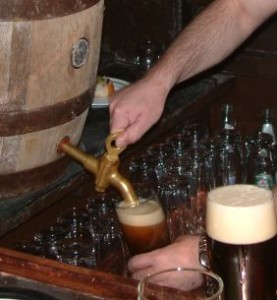
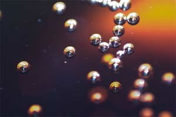
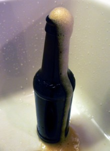
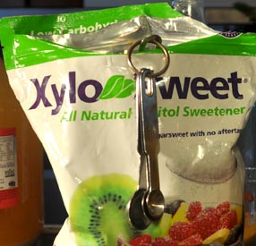

    

Natural carbonation (“carb” or “carbing” in brew speak) and alcohol are both products of our friends–the yeast. When yeast begins to eat sugar, they digest it, and carbon dioxide gas and alcohol are both produced as a waste product. Yes, when you are drinking hard cider (or any other brew) you are drinking yeast poop. Don’t like it? Well, you better give up bread too. Here is a  simplified overview of how the process works and how you can use your knowledge to tailor your hard cider to your tastes.

## A quick look at alcohol formation:

Alcohol is what makes the hard cider hard. Alcohol is produced when yeast begins to break down the sugar that is in your sweet cider. This alcohol production is called “fermentation.” If you have sweet cider, any yeast that comes in contact with it is going to quickly begin to eat up any of the natural sugars that are in the juice. The yeast will continue to eat, and reproduce, and make alcohol–until the sugar is all used up.

The “alcohol content” of your final brew will be determined by how much sugar you start out with. If you want to have a higher alcohol content, you will need to add more sugar at the beginning of the fermenting (alcohol making) process. How will you know if you need to add more sugar? Without some more complicated equipment (and calculations), you actually will _not_ be able to measure the potential for alcohol production of your juice, or the exact alcohol content of your brew. The amount of sugar in any given batch of apple juice can vary widely, year to year and crop to crop. Rule of thumb is if you add no extra sugar (i.e. sugar that was not originally in the juice, like brown sugar, honey, frozen apple concentrate) you will end up with a cider around 3.5-4.5% alcohol. If you add 1/4 (12oz) can of frozen apple juice concentrate to your gallon of cider, you can (no pun) bring this up to about 5-6%. Add another 1/2 cup of brown sugar to all of this, and you can see around 7 – 8% (yeeowza!). If you add any more than that, you are about to make apple wine. This happens when the yeast make so much alcohol that the can’t survive in the toxic soup and they die off. (If you want to make apple wine, use the Lavlin [EC 1118](http://www.amazon.com/gp/product/B003TOEEFG/ref=as_li_tl?ie=UTF8&camp=1789&creative=390957&creativeASIN=B003TOEEFG&linkCode=as2&tag=howtomakeha07-20&linkId=6LMOMGFZK6JXHUPB) yeast, as it can survive to ~13% alcohol content or so…but this is a cider site so you will need to look elsewhere for help with that). For cider, we are going to use an ale yeast, like [Nottingham](http://www.amazon.com/gp/product/B000MI70GW/ref=as_li_tl?ie=UTF8&camp=1789&creative=390957&creativeASIN=B000MI70GW&linkCode=as2&tag=howtomakeha07-20&linkId=P5MWMK2QOAMQKXET) . Yes, there are “cider” yeasts, but aside from the [White Labs 775](http://www.anrdoezrs.net/links/7281718/http://www.midwestsupplies.com/white-labs-wlp775-english-cider-yeast-bundle.html?utm_medium=affiliate&utm_source=commissionjunction) I don’t know too many folks that swear by them. Lots of folks on the forums like Nottingham. If it is important for you to know exactly how much alcohol is in your hard cider, visit one of the cider forums in the [links section](links.html) to learn how to use a [(Hydrometer)](http://www.amazon.com/gp/product/B000E60U6Y/ref=as_li_tl?ie=UTF8&camp=1789&creative=390957&creativeASIN=B000E60U6Y&linkCode=as2&tag=howtomakeha07-20&linkId=BU23FO2DTVMISCKV) and what you need to measure.

## Tiny Little Bubbles. The Basics of Carbonation

    

The first thing that you will notice after adding your yeast (well, in about 24 hours) is the little bubbles that begin to form around the top of the liquid. In a day or two, this bubbling will be blooping out of your airlock at a rate of more than one bloop per second. Of course, if you added more sugar, you are going to get more bloops. The more sugar that is in there, the more the yeast can eat, and the faster they will reproduce. More sugar = more yeast = more bubbles = more alcohol. The amount of time it takes to get the yeast going is also dependent on the temperature of the juice. With the Nottingham yeast (or other ale yeast) it is recommended to keep your brew room fairly cool 55 – 65F. Some cider makers try to slow it down even further by using lager yeasts that like even lower temps around 40 – 50F. What you want is a room that you can control the temperature so that you don’t get wild swings. Slow and steady wins this race, for sure.

If you are seeking a finished hard cider that will be fizzy (as in carbonated) instead of still (not fizzy), you have three options for obtaining good results:

_**Option one: “Almost Exhausted Carbonation”**_ If you are in it for speed, or don’t want to add more sugar at the end, AND you are wanting to guess about the carb levels… choose the “almost exhausted carb” bottling method. This is the method that requires you to take a guess about how far along the carbonation is, and then bottling your brew when the bubbles are almost subsided. Can you see how this might be tricky your first few times around? How do you know when the bubbles are _almost_ done if you don’t know how much longer they will take to be done?

    

For the almost-exhausted carb method, I recommend using a hydrometer [(Buy one with free shipping for just \$6 on Amazon)](http://www.amazon.com/gp/product/B000E60U6Y/ref=as_li_tl?ie=UTF8&camp=1789&creative=390957&creativeASIN=B000E60U6Y&linkCode=as2&tag=howtomakeha07-20&linkId=BU23FO2DTVMISCKV)  
This tool will let you know exactly where your yeast is in relation to starting specific gravity [the measurement you took before adding yeast] versus totally expended sugars [at the end]. If this does not sound like fun, believe it or not, if you make up a few gallons of cider using the same yeast with the same juice at the same temperatures, you will start some definite patterns that you can use in the future. If you do have a hydrometer, you want to check that your brew is *at or below* 1.010 S.G before you bottle.

This is not the method I am going to recommend for first timers, just because it is another thing you have to buy, and you will do okay without it. If you do opt to use a hydrometer and stop it just right, the remaining yeast and sugar that is in the juice will keep carbonating in the bottles until the sugar runs out. So do not add any EXTRA sugar at bottling time, like the back carb method. This would kick all the yeast back into full production and you will end up with over carbonated bottles of cider that make geysers when you open them (like the photo on the left) or worse, exploding bottles. With this method, adding flavor and [Stevia](http://www.amazon.com/gp/product/B005F9XFN0/ref=as_li_tl?ie=UTF8&camp=1789&creative=390957&creativeASIN=B005F9XFN0&linkCode=as2&tag=howtomakeha07-20&linkId=7NCCL7RMXTAEABH5) or [Xylitol](http://www.amazon.com/gp/product/B0013OQHUE/ref=as_li_tl?ie=UTF8&camp=1789&creative=390957&creativeASIN=B0013OQHUE&linkCode=as2&tag=howtomakeha07-20&linkId=OVVTWD5XOSMYZEBC)  
are okay (more about this on the next page) as the yeast cannot make carbonation or alcohol out of these.

_**Option two: “Back Carbonation”**_ If you are wanting a more controlled carbonation experience, choose the “back carbonation” method. The difference in this method is that you should WAIT until bubbling has nearly stopped and there are only few little tiny bubbles around the surface of the neck of the jug. You are letting the yeast convert ALL of the sugar (natural and added) in the cider to alcohol, and the cider will be “dry.” This should take about 2 weeks. After you move the cider to the secondary jug (more about this in racking and bottling) you will let it sit even longer (another ~2 weeks) to make sure all of the sugar is eaten up. If you taste the cider at this stage, it will be very dry, even bitter. But not to worry. If you want sweet cider, just add some sugar alcohol (like the xylitol in the photo below) to the brew that the yeast can’t eat up. Back carbonation gives you much more control over how dry or sweet, and even still or fizzy your cider is. If you would like a nice, fizzy cider: for a gallon at bottling time, add **either**:

-   1/8 – 1/4 cup of brown sugar (for best mixing, dissolve sugar in 1/2 cup of boiled water, before you add it) **OR**
-   1/4 of a can of frozen apple juice concentrate, **OR**
-   Corn sugar ([Dextrose \$12 ships free from Amazon](http://www.amazon.com/gp/product/B008MVJKFU/ref=as_li_tl?ie=UTF8&camp=1789&creative=390957&creativeASIN=B008MVJKFU&linkCode=as2&tag=howtomakeha07-20&linkId=KDQAZGPAN5E5UIX6)) This will give you those tiny little effervescent bubbles. **OR**

-   1/8 cup dextrose per gallon of cider. **OR**
-   1/2 tsp. dextrose added into EACH PINT BOTTLE as you bottle. **OR**
-   3/4 cup dextrose for 5-6 gallon carboy (jug).

    

After you add the sugar, you will leave it in the bottles for about 2 weeks. Then pop one open to check and see how carbonation is coming along. You should only have a moderate fizz by then. More about this in the [Rack and Bottle](rack-bottle.html) section. The thing to remember here is that adding back sugar to your brew is _not_ going to make it taste sweeter. The yeast is going to eat this sugar up and make it into bubbles (carbonation). If you want _sweeter_ cider, use a zero-calorie low glycemic sweetener like [Stevia (I like this NOW brand because it has no bitter aftertaste)](http://www.amazon.com/gp/product/B005F9XFN0/ref=as_li_tl?ie=UTF8&camp=1789&creative=390957&creativeASIN=B005F9XFN0&linkCode=as2&tag=howtomakeha07-20&linkId=7NCCL7RMXTAEABH5), or a  
sugar alcohol like [Xylitol](http://www.amazon.com/gp/product/B0013OQHUE/ref=as_li_tl?ie=UTF8&camp=1789&creative=390957&creativeASIN=B0013OQHUE&linkCode=as2&tag=howtomakeha07-20&linkId=OVVTWD5XOSMYZEBC) (great for humans, poison for dogs…). Any sweetener that is zero-calorie means that yeast cannot eat it–so yes, you can use the chemical stuff too (pink, blue, Splenda, etc…). Do NOT just try and add more _sugar_ to make your finished cider sweeter. You will be making little bombs, and that is a waste of cider!

We will talk much more about all of this on the [Rack and Bottle](rack-bottle.html) Page.

_**Option three: “Forced Carbonation.**“_ Simply inject your finished brew with CO2 bubbles from a tank. This is how ALL commercial brew is carbonated (cider, beer, seltzer and soda pop). It is safe, measurable, predictable… and it has a bit of an investment cost. I recently got a hold of a fantastic Home Carbonation system from Amazon called the [Fizz Giz Soda Rope.](http://amzn.to/2ewHQ49) With this $59 device, you simply add [your own small CO2 tank](http://amzn.to/2eG9KOB) (which you can fill at any welding supply, medical supply or fire extinguisher service for around $3-5). _[NOTE: All CO2 tanks and gas are “food grade.” All gas tanks have to be certified by the same governing agency, so they have no oil or lubricants.]_ To use the Soda Rope, you simple attach it to your tank, and then inject the CO2 into plastic bottles using the Fizz Giz caps (included in the kit, or [here on Amazon, 3 for \$9](http://amzn.to/2fyme8D)). I have used this device to carbonate gallons of brew, and here is what works best for me:

1.  Move your cider into plastic 2 Liter bottles, leaving about 3″ of empty space at the top.
2.  Put the bottles in the fridge to chill (CO2 moves into very cold liquid best)
3.  Remove chilled brew from the fridge, place the Fizz Giz cap on lightly, and squeeze the bottle to force the air out.
4.  Tighten the Fizz Giz cap, invert the bottle, and push the trigger on the Soda Rope to fill the bottle with CO2\. Keep filling until the hissing stops.
5.  Shake the bottle hard! This helps the CO2 go into the brew, and the bottle will collapse again.
6.  Fill and shake the bottle until it remains hard–at least 2 more times.
7.  Return bottle to the fridge to chill. The next day, shake and fill again. Bottle should be super hard and not hiss when filled.
8.  Return fully carbonated bottle of cider to the fridge to chill.
9.  Clean and sterilize your glass bottles and caps. Slowly pour the carbed cider from the 2 Liter bottles into the glass bottles to fill them with the carbonated cider. Yes, you will lose a little CO2, but the cider will still be very fizzy.
10. Done! Perfectly carbed cider, ready to drink!

If you are a seltzer or soda pop drinker (or want to put up beer or sparkling wine) this system is a life saver, and can pay for itself in a few months! The inventor Mike Spike (aka Mr. Fizz)is a heckava nice guy too, and you can [watch some of his YouTube videos here](https://www.youtube.com/watch?v=5ERaX0TF6ws). If you are looking for a turn-key system without the hastle of a bigger tank, he also offers [a smaller \$49 version called Soda Maker here on Amazon](http://amzn.to/2fM79oM) that runs off of the little CO2 canisters. This is great if you are not making a bunch of brew, or if you want to have a carbonation sytem you can take to a party!

If you are making still cider (no fizz), or apple wine, you will not need to do any stopping of the fermentation. part-way, or addition of back-sugar. Honestly, you don’t even need to mess with the bottling at all if you are wanting still cider. You can just pop the whole jug in the fridge and drink it at will. If you are wanting to make apple wine, I would encourage you to look at another website for apple wine tips, this is a hard cider site for Pete’s sake!

Ready to get on with making your cider? I think you are ready to visit the [Making Hard Cider](https://howtomakehardcider.com/making-your-cider/) page!

_Text and Xylitol photo, Jessica Shabatura. Other photos: [[9](links.html)] Cider on tap photo [Wikipedia commons](http://en.wikipedia.org/wiki/File:GravityTap.jpg). [[10](links.html)] Bubbles photo [Wikipedia commons](http://en.wikipedia.org/wiki/File:Soda_bubbles_macro.jpg). [[11](links.html)] Over carbonation photo: [brewersfriend.com](http://www.brewersfriend.com/2009/06/01/over-priming-home-brew-bottle-bomb/)_
