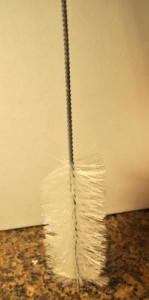

One of the biggest mistakes made by first-time brewers is not preparing every bit of requirement. Cleaning is removing unwanted particles that you can see. Funk. Gunk. Nasty bits. In contrast, *sterilizing* is removing the unwanted particles you *can’t* see. Bacteria. Mold. All the microscopic guys.

## Cleanliness is Essential

If you begin with new or used bottles, you must clean them. Only use bottles with tops for a bottle cap opener– not screw top [twist-top cap] bottles (the neck is thinner glass so it will break). You need to get in the habit of washing everything, every time. If you don’t, you invite trouble. Trouble is expensive, and it tastes like vinegar!

    

**_Cleaning Step One:_** Always soak any equipment that will touch your apple juice. Spoons, jugs, tubes, bottles, etc. A big sink or clean food-grade bucket is best for this. Using an [oxidizer like “PBW” by Five Star](http://amzn.to/2ygFXWu) helps to bubble away the funk. Some folks use bleach, but be careful. It tastes like bleach if you don’t get it rinsed well! If you are just cleaning new bottles, or ones that you cleaned properly from last time, give them a good 15+ minute soak in the oxidizer. I leave my siphon tube soaking for a good hour to let the oxidizer get all the way in the tube with its bubble action.

1.  **_Cleaning Step Two:_** Give it a scrub. Even if you don’t see any cling-ons, the inside of tubes and bottles have lots of little crannies for stuff to hide. You are going to need a good Bottle Brush (like the photo on left).
2.  **_Cleaning Step Three:_** Rinse it well with clean water. Who wants a bunch of oxidizer or soap in their brew? Not you. And now that everything is washed up, let’s move on the getting things sterile!

And now that everything is washed up, let’s move on the getting things sterile!

## Make it Sterile

Clean vs. sterile is a matter of *how many* organisms are left alive on a suffice after you treat it. Soaking a glass (or plastic or rubber) surface in a solution of iodine will do the trick to remove almost all of the microorganisms. It will also stain everything (including you) yellow-brown. Bleach will work as a sterilizer too. However, bleach will destroy plastic and rubber. I don’t use iodine or bleach because it is easy to end up with a terrible off-taste in your brew, and also because it will stain and destroy my plastic equipment.

My top recommendation for a sterilizing solution is [Star San](http://amzn.to/2cEm1z7) because it is effective, does not add an odor, and it is inexpensive ([\$11 for 8oz](http://amzn.to/2cEm1z7)). This is an acid based sanitizer that you mix 1oz to 5 gallons of water–and once it is mixed it will last 3-4 weeks so you can reuse it. There is a handy mix-measure top in the cap, so all you have to do is add the right amount of water. Over time, Star San it breaks down to a simple sugar that is actually food for the yeast, so no off flavors!

1.  **_Sterilizing Step One:_** Mix up a batch using tap water and 1oz of [Star San](http://amzn.to/2cEm1z7) per 5 gallons. The squeezy measuring cap makes this foolproof. If you will be using a sink or bowl, measure your water out by filling up your [1-gallon jugs](http://amzn.to/2xySBfJ) and pour them into the sink or bowl. Measuring your water is critical.
2.  **_Sterilizing Step Two:_** Give everything a soak in the sanitizer solution for AT LEAST 2 minutes. You can leave any glass in the solution longer, but don’t rush this. If you are going to be brewing in a 5-6 gallon carboy (big glass jug), fill that pup up and let it sit 15-minutes. When you pour the solution out of a carboy, you can catch it and use it to sanitize everything else for the next 4-weeks.
3.  **_Sterilizing Step Three:_** DON’T RINSE with tap water, or dry with a towel! Tilt the bottles/carboys on their sides and let the solution drain to one side, rest, and then pour off as many drips as you can. Star san claims to be “rinse-free,” but sometimes the bubbles still show up in final brew. I always swish-rinse with a bit of bottled water or freshly boiled water to make sure the Star San won’t make suds in my brew (been there).
4.  **_Sterilizing Step Four:_** If you need to store your bottles for a bit, a freshly cycled dishwasher is fairly sterile and makes a good staging area. If you are not using your carboy right away, cap it with a sterilized bung (cork).

Just remember that *everything* that is going to come in contact with your brew is going to need to be washed and sterilized. Measuring cups, measuring spoons, funnels, hoses, your hands… everything. That happy little bacteria that can spoil your brew could come from anywhere. Scary? Yes, but you can do this. Just be careful.

Got the gist? Let’s move on to [Selecting the Fruit and Yeast](https://howtomakehardcider.com/selecting-fruit-and-yeast/).

Return to [top](#top)
