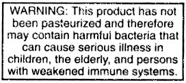

## Making Hard Cider? Oh so many juice options!

The foundation of tasty cider is fruit juice that you select. Unless you own an apple orchard, you have basically 3 options:

1.  Raw Orchard Fresh Cider – from a local orchard stand, or farmer’s market. No pasteurization or preservatives. Tasty, but sorta sketchy.
2.  Pasteurized Orchard Cider – this is my top pick. All of the flavor, none of the _E. Coli_ bacteria.
3.  Pasteurized Cider – from the grocery store (that does not contain preservatives) Not so flavorful, but fine in a pinch.

---

## Raw Orchard Cider

The most popular and undeniably best apple juice to use is fresh pressed sweet cider from a local orchard. It is very important that you check to make sure that the juice has not been “stabilized” with chemical preservatives, but any cider sold as “raw” will be free of these chemicals. If an orchard uses no treatment of any type, the sweet cider is considered “raw,” and should be labeled like this:

    

Is there a real risk in drinking or brewing with non-pasteurized cider? Sadly, yes. Back in the “good old days” when cider was made from “drops” (the apples that had fallen off the tree to the ground), the risk was much greater. Now, it is illegal to use these “drops” or process them into cider that will be sold, but there is never a guarantee that the apples that were squeezed into your cider did not come in contact with the ground or other contaminated harvesting equipment.

The problem with apples is that they are so darn yummy—every mammal and bird around wants to come for a nibble. This means mice, deer, raccoons, opossums and every other critter with a sweet-tooth comes running when the apples are ripe. These critters leave their droppings along the apple production line, and what they leave, can make humans very, very sick. Is it worth the risk? Not to me, but hey, you are a grown-up, so decide for yourself! Since 1986 it has been illegal for cider resellers to sell unpasteurized cider to anyone but direct consumers. [[8](links.html)].

    

What is not recommended is to obtain raw cider and try to ‘pasteurize it’ yourself. Apple juice is tricky stuff. If you heat it a few degrees too hot (i.e. to ~175F.) you are going to end up with thick, hazy juice. If you under heat it, or don’t heat it long enough, it will not be sterile. If you don’t mind risking a haze, Cornell University’s formal recommendation that at 160°F, 99.999% (a “5 log reduction”) of the E. Coli O157:H7 is killed after six seconds.

Now I know there are cider purists out there who would never dream of making a brew from juice that had been pasteurized. That is fine, I just want to clearly report that there is a risk involved with using unpasteurized cider. Making hard cider will NOT magically sanitize the juice somehow because it has alcohol in it. The alcohol content in cider is not that high. If your juice is contaminated, your hard cider may be too.

---

## Pasteurized Orchard Cider

    

Many orchards now pasteurize all of their cider because of the liability of folks getting sick. Orchards can either ‘traditionally’ pasteurize their juice (long, gentle heat it to kill microbes) ‘cold pasteurize’ it with UV light. Fortunately, any type of ‘pasteurization’ will not prevent your yeast from producing hard cider. Just ask if the juice has any chemical preservatives in it. Even better, tell the orchard folks you are making hard cider, and I bet they will have some wonderful tips!

Honestly, pasteurized cider from an orchard is the best of both worlds. You get the safety for the pasteurization, but you also get the full fruit taste, and the satisfaction of shopping locally! Sadly, most of the orchards who sell cider locally here in the Ozarks are now adding chemical preservatives, which makes the cider useless for making hard cider. The one exception I have found to this is [A&A Orchards](https://aandaorchard.com/) who sell their scruptious ciders (both Jonathan and Honeycrisp) at the Fayetteville, AR and Rogers, AR farmers markets. This orchard uses Integrated Pest Management (IPM) and is harkening back to some of my favorite clasic cultivars–including several veritals I had never heard of! They are partnering with some local brewers to create some killer brew. Check them out if you are local.

---

## Good ol’ Grocery Store Cider

It’s true! Perfectly yummy hard cider can be made from the sweet cider you buy at the grocery store! If you are buying cider from a retail source, like a grocery, it will say “pasteurized” on the label. All you have to do is make sure that there are no chemical preservatives. So why do most grocery store ciders have preservatives? These chemicals, like potassium sulfate and sodium benzoate, prevent bacteria, mold and yes, even your wonderful cider yeast from growing in the juice. In other words, you CANNOT make hard cider from juice with chemical preservatives in it! In some places, it might not be possible to find cider at the store without chemicals in it. Don’t be tempted to use the crystal clear “apple juice” sitting in the Mott’s jugs in the juice section. This will make a very bland, watery cider. You are looking for cloudy, brown sweet cider/apple juice with a nice bunch of sediment in the bottom of the jug. The liquid at the top of the jug may be clearer than the bottom, but if you give it a good shake, the cider should become very cloudy.

Some “apple juices” I have found at health food stores like Whole Foods, is nice and cloudy and qualifies for cider in my book. Cider in a glass jug will cost you more than cider in a plastic jug, but because the juice was pasteurized in the jug, you can just add your yeast and go! And you get a “free” glass jug to add to your brew equipment arsenal.

Bottom line: Look for cloudy cider/juice. Avoid any cider that has a listed ingredient (other than ascorbic acid) that says “in order to preserve freshness.” Potassium Sorbate, Sodium Benzoate, etc… Those bad boys are yeast killers.

Vitamin C, also called ascorbic acid, is a perfectly harmless additive, for both you and your cider yeast. Sometimes you will find “Malic Acid” added in. This is apple acid (Malus is Latin for apple) and it is fine too.

Vitamin C, also called ascorbic acid, is a perfectly harmless additive, for both you and your cider yeast. Sometimes you will find “Malic Acid” added in. This is apple acid (_Malus_ is Latin for apple) and it is fine too.

Here is the ingredients label from the pasteurized, yet non-chemically preserved juice I can purchase here in the Ozarks at our local Walmart:

    

    

The three commercially available ciders that I have used with great success are:

1.  Musselman’s Apple Cider- A nice sweet cider with lots of solids. Sold in a plastic one-gallon jug. It was \$4.98/gal at the Walmart here in Arkansas, October. 2017.
2.  Whole Foods 365 Organic Apple Juice – Labeled as “apple juice,” not cider, but this is a wonderful base for hard cider. It has much more suspended solids. If you would like to go organic, this is an excellent choice. \$7.49 at Whole Foods.
3.  Santa Cruz Organics Apple Juice- Another good buy around \$8 bucks for organic juice in a glass jug. Lots of solids for good flavor.

No health food store? Buy flash pasteurized orchard cider from PA without preservatives here on Amazon: [Kauffman’s Homemade Fresh Apple Cider (\$30 for 2 gallons)](http://www.amazon.com/gp/product/B00MP0X7MQ/ref=as_li_tl?ie=UTF8&camp=1789&creative=390957&creativeASIN=B00MP0X7MQ&linkCode=as2&tag=howtomakeha07-20&linkId=B4DDYT5SGGVOC5RL)

---

Let’s move on now to the work-horses of cider making, the yeast.

## Yeast: Wild or Domesticated

    

One of the magical things about hard cider is… the process would happen without you doing anything at all. There are enough wild yeasts just floating around in the air, that it is quite likely that some would find their way into your juice and go to work; eating and making alcohol. So why not just let nature take its course? In fact, many people who make hard cider do just that! They open their jugs of sweet cider up to the air (or they have a nice batch of apple yeast from the cider mill already in the juice) and hope for the best. Sometimes they have great results, sometimes they have disasters. I usually end up with a brew someplace in between–maybe a bit bitter or a little “yeasty” tasting.

The real truth of using wild yeast is it is just going to depend on where your wild yeast comes from. Most folks at cider mills swear by using wild yeast, but that is because the yeast that lives at their apple processing facilities is especially adapted to work with apples. What about the yeast floating around in your kitchen (or bathroom?) You could end up with fantastic cider, horrible cider, or even vinegar (actually made from bacteria, but I digress). Now if you are risking the raw cider, there is a good chance you have some wondrous yeast already in your cider from the cider mill equipment. Could be worth a go.

For me, because I don’t have abundant juice from a cider mill to play with, I like a little less experimenting and a lot more predictability. Yeast in a package is wild yeast that was “caught” and then cultured over many years for its wonderful characteristics. A package of yeast is very inexpensive and lasts for years in an unopened package (in the fridge or freezer). For around a dollar or two, you will have enough yeast for 5 gal worth of cider. Just don’t be tempted to use bread yeast–whole different animal. Here are the strains of yeasts that I have used in cider with success:

---

    

**Lalvin E-1118:** Comes in a 5-gram packet. This is a wine/champagne yeast and as a wine maker I happen to have it laying around. It is also one of the most widely used yeasts in the world for “general application,” like cider. It is very vigorous and out-competes most wild yeasts. Basically, this yeast goes fast. It will chew up all the sugar you give it, stop when it is dry, and then it carbonates up fast. I use this when I can’t get the temperature in my brew room colder than 65F. [Buy 5-grams Lalvin EC-1118 Yeast](http://www.amazon.com/gp/product/B002LQBSIO/ref=as_li_tl?ie=UTF8&camp=1789&creative=390957&creativeASIN=B002LQBSIO&linkCode=as2&tag=howtomakeha07-20&linkId=NEJRRZ3HU6TQ2JJM) for \$4.

---

    

**Nottingham Ale Yeast:** This is my top recommendation. Comes in an 11-gram pack so you can easily do up to 12-gallons of cider. I read about this yeast when microbrews talk about brewing both ale and cider. It is fast and hungry. Is reputed to have good flocculating qualities (i.e. sinks, and thus makes clear cider) and does not impart a yeasty aftertaste. This yeast is quite happy fermenting at 55 – 65F so I use it in the fall/winter time of the year. Goes slow, and slow is good for cider flavor. If you choose this yeast you will get a nice fruity “draft” ale tasting brew. [Buy 11-grams Danstar Nottingham Ale Dry Yeast](http://www.amazon.com/gp/product/B000MI70GW/ref=as_li_tl?ie=UTF8&camp=1789&creative=390957&creativeASIN=B000MI70GW&linkCode=as2&tag=howtomakeha07-20&linkId=P2RRLFOQ3YOPXRHB) for \$7.

---

    

**Safcider 40725 Cider Yeast:** Not a very sexy name, but folks on the cider blogs are raving about how it holds apple flavor. 5-gram pack will make 5+ gals of cider. Reported to work under a wide temperature range between 50 and 86F (10 and 30C), with an ideal range is between 64 and 75F (18 and 24C). It is a champagne type yeast, so I have found that it benefits from a little more aging before you bottle. [Buy 5-grams Safcider 40725 for \$6](http://amzn.to/2xZQ1D4).

---

    

**Safale S-04:** A standard in the microbrew community, I use this when I need cider fast (Thanksgiving? New Years, anyone?) According to their website the strain was selected English ale yeast, selected for “fast fermentation character” and its flocculate (drop out at the end of fermentation and leave you with clear brew). This is a true ale yeast, so it can go as high as 18% alcohol, so if you give it too much sugar, you’ll get apple “wine.” I sometimes use this yeast at the end of the cider process to carbonate.  [Buy 11-grams of Safale S-04 for \$6\.](http://amzn.to/2xUyMBz)

---

And there are many, many other yeasts you can use. Everyone seems to have a favorite brew yeast. Check out some of the [cider forums listed in the links section](links.html) of this site and join the “what’s the best cider yeast” conversation!

But what to do with all this juice and yeast? Let’s get started [Making Your Cider!](https://howtomakehardcider.com/making-your-cider/).

Return to [top](#top)

_Text and images on this page by Jessica Shabatura except for: Warning Label [[1](links.html)], Harvest Apples [[6](links.html)], Cider Pressman [[4](links.html)], Wild yeast [[7](links.html)]. Please see links page for details._
