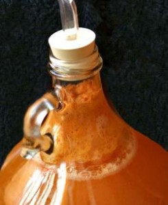

 <iframe width="1600" height="900" src="https://www.youtube.com/embed/rbYAFCdtm6w?feature=oembed" frameborder="0" allow="autoplay; encrypted-media" allowfullscreen=""></iframe>

    

## You Can Make Homemade Hard Apple Cider!

Welcome to the How to Make Hard Cider website! This site was created to help you with your first adventures in hard cider making, even if you have never brewed any wine or beer before.

## How this website works

This site covers the _very basics_ of cider making. We will be making 7-8 16oz bottles of hard cider from **one gallon of cider**. Of course, this recipe is expandable, but if you are a first-time brewer I strongly recommend starting small so that you can make smaller inexpensive mistakes, and not ruin \$50 worth of cider by doing something silly (note the voice of experience here)!

This site will give you what you need to start brewing, and also provide you with enough knowledge that you can experiment until you achieve some pretty tasty hard cider! There’s a minimum of equipment I recommend–around $10-$20 total (if you get your glass jugs at the recycling center) and most of this equipment you can reuse for years. Yes, you can make simple “hard cider” with bread yeast, a plastic jug and a balloon on top. If you want help with these crude methods, look for another website, and don’t invite me over for a taste. Blech.

This website is not intended to be the ultimate word in hard cider. Brewing can be a complex trip down the paths of chemistry, pH, specific gravity, temperature regulation, and microbe management. If you are wanting more about pressing your own apples or large-scale production–well, that is beyond the scope of this website, please check out the [links section](/links-and-credits) for some helpful resources for your grander pursuits!

This site has the following sections. You will have the most success if you read them _all_ before you begin:

-   [Clean and Sterile](/clean-and-sterile) – This section covers the basics of keeping your equipment (and thus your cider) uncontaminated.
-   [Fruit and Yeast Selection](/selecting-fruit-and-yeast) – This sections examines the options you have for your apple juice and yeast strains.
-   [Making Your Cider](/making-your-cider) – Here we take a step-by-step approach to taking what you learned and making, and bottling a gallon of homemade hard cider.
-   [Carbonation and Alcohol](/carbonation-and-alcohol) – Sweet or Dry? Flat or Fizzy? This section looks at the basics of cider chemistry so you end up with the style of brew you like!
-   [Bottling](/racking-and-bottling) – How to get it into from the jug to the bottles.
-   [Links and Credits](/links-and-credits) – A section of equipment resellers and other useful cider making links, also a works cited list.

First of all, what is cider? In the USA and also in Canada, ‘cider’ is used to describe a cloudy but unfermented (non-alcoholic) apple juice, often from an orchard stand or farmer’s market. The term ‘hard cider’ is used to denote that this cider has been fermented, and now contains alcohol. To differentiate between hard cider and cider, sometimes you will see the terms “sweet cider” used. In most of the rest of the world, including the UK and Europe, just saying plain ‘cider’ means alcoholic hard cider. Just remember, after you add the yeast, it is no longer sweet cider, so I might just call it “cider” by that stage in the process out of habit.

## Is making my own hard cider legal?

YES! In the U.S., as long as you _don’t sell it_, every adult in your home may brew up to 100 gallons of wine, beer or cider per year. More than that, and you need a liquor license… and likely a 12-Step Program.

## Here is what you will need to make hard cider

Here is an equipment list for **one gallon** of hard cider (each item will be described in detail later in the site):

-   1 gallon of apple cider (fresh pressed, or store bought–_without_ preservatives!)
-   TWO GLASS 1-gallon jugs. (if you buy cider (juice) in plastic, you will need to move it into glass to ferment. If your juice came in a glass jug, this counts as one of your jugs, but you will need another jug too.) [1 Gallon glass Jug (\$9 ships free from Amazon.com)](http://www.amazon.com/gp/product/B0064O8Z76/ref=as_li_tl?ie=UTF8&camp=1789&creative=390957&creativeASIN=B0064O8Z76&linkCode=as2&tag=howtomakeha07-20&linkId=SUC7UPX2FBIKFMAV)
-   A rubber stopper with a hole. For a 1-gallon jug–you need a Drilled #6 size. [Here is a set of 3 – \$5 ships free from Amazon)](http://www.amazon.com/gp/product/B00AFD9VSE/ref=as_li_tl?ie=UTF8&camp=1789&creative=9325&creativeASIN=B00AFD9VSE&linkCode=as2&tag=howtomakeha07-20&linkId=2L3BK6CWSYTAR5UB)
-   An airlock, also known as a “bubbler” ([Twin bubble airlock Set of 3 – \$6 ships free from Amazon)](http://www.amazon.com/gp/product/B008ACWSZU/ref=as_li_tl?ie=UTF8&camp=1789&creative=9325&creativeASIN=B008ACWSZU&linkCode=as2&tag=howtomakeha07-20&linkId=6B2TDK5RTMSBAHJ2)
-   Brewing yeast (NOT bread yeast)
-   Star San for sterilizing. Super concentrated:1 oz. makes 5 gallons of sanitizer! ([\$10 for 4oz ships free from Amazon – free ship](http://www.amazon.com/gp/product/B00E5MXGKK/ref=as_li_tl?ie=UTF8&camp=1789&creative=9325&creativeASIN=B00E5MXGKK&linkCode=as2&tag=howtomakeha07-20&linkId=24MMXTA5VCF5W7QE))
-   1 Camden tablet (only if you are using fresh, non-pasteurized cider and want to control your yeast – [Campden Tablets (sodium metabisulfite) – 50 Tablets \$5 ships free from Amazon)](http://www.amazon.com/gp/product/B0064H0LHA/ref=as_li_tl?ie=UTF8&camp=1789&creative=9325&creativeASIN=B0064H0LHA&linkCode=as2&tag=howtomakeha07-20&linkId=M45L4DWENUBDR6XB)
-   3 to 6 feet of 5/16-inch food-grade plastic tubing ([10 feet \$8 ships free from Amazon.)](http://www.amazon.com/gp/product/B000E62TCC/ref=as_li_tl?ie=UTF8&camp=1789&creative=9325&creativeASIN=B000E62TCC&linkCode=as2&tag=howtomakeha07-20&linkId=2NBMFN5MRCTTRAVR)

### OPTIONAL equipment you might decide you need:

-   Extra [1 Gallon glass Jug (\$9 ships free from Amazon)](http://www.amazon.com/gp/product/B0064O8Z76/ref=as_li_tl?ie=UTF8&camp=1789&creative=390957&creativeASIN=B0064O8Z76&linkCode=as2&tag=howtomakeha07-20&linkId=SUC7UPX2FBIKFMAV)
-   One-step oxidizer for cleaning
-   Large stainless bowls or stock pot
-   Frozen apple juice concentrate
-   Brown sugar
-   [Dextrose](http://www.amazon.com/gp/product/B008GQ2JPO/ref=as_li_tl?ie=UTF8&camp=1789&creative=390957&creativeASIN=B008GQ2JPO&linkCode=as2&tag=howtomakeha07-20&linkId=FEQKNEMPEIWIAAAD)  
    sugar (for carbonating)
-   [Stevia](http://www.amazon.com/gp/product/B005F9XFN0/ref=as_li_tl?ie=UTF8&camp=1789&creative=390957&creativeASIN=B005F9XFN0&linkCode=as2&tag=howtomakeha07-20&linkId=7NCCL7RMXTAEABH5), or sugar alcohol like [Xylitol](http://www.amazon.com/gp/product/B0013OQHUE/ref=as_li_tl?ie=UTF8&camp=1789&creative=390957&creativeASIN=B0013OQHUE&linkCode=as2&tag=howtomakeha07-20&linkId=OVVTWD5XOSMYZEBC)  
    (makes your cider taste sweeter naturally, without feeding yeast)
-   [Pectic Enzyme](http://www.amazon.com/gp/product/B0064GZPWM/ref=as_li_tl?ie=UTF8&camp=1789&creative=9325&creativeASIN=B0064GZPWM&linkCode=as2&tag=howtomakeha07-20&linkId=KT2UBE66ZJDIUSYJ)  
    (1oz is \$5 ships free from Amazon. Will make the cider less cloudy)
-   Natural organic Apple flavoring [4 oz by OliveNation on Amazon.com](http://www.amazon.com/gp/product/B004QXKQN8/ref=as_li_tl?ie=UTF8&camp=1789&creative=9325&creativeASIN=B004QXKQN8&linkCode=as2&tag=howtomakeha07-20&linkId=MCUDFBIKWTK63URI)  
    – this would do ~50 gallons)
-   Bottles, if you are carbonating your cider ([flip top Cap](http://www.amazon.com/gp/product/B005CIFIDO/ref=as_li_tl?ie=UTF8&camp=1789&creative=9325&creativeASIN=B005CIFIDO&linkCode=as2&tag=howtomakeha07-20&linkId=V4LBGVYCIXZOXTVD) like Grolsch style beer bottles), or cap style–obviously you would also need unused bottle caps ([144 caps is \$6 free ship from Amazon](http://www.amazon.com/gp/product/B00023B72U/ref=as_li_tl?ie=UTF8&camp=1789&creative=9325&creativeASIN=B00023B72U&linkCode=as2&tag=howtomakeha07-20&linkId=ED5ILYLQ64F24ATT)) and a capper [[\$16 free ship from Amazon]](http://www.amazon.com/gp/product/B001D6KGTK/ref=as_li_tl?ie=UTF8&camp=1789&creative=9325&creativeASIN=B001D6KGTK&linkCode=as2&tag=howtomakeha07-20&linkId=XWJ4OJHKTOSGIOS3) if you go with beer bottles.
-   [Auto-Siphon tool](http://www.amazon.com/gp/product/B0064ODELI/ref=as_li_tl?ie=UTF8&camp=1789&creative=9325&creativeASIN=B0064ODELI&linkCode=as2&tag=howtomakeha07-20&linkId=VVNEYYZLFVNL6P3Z)  
    (about \$9 on Amazon, but worth its weight in gold)
-   A bottle filler hose extension ([\$7 on Amazon,](http://www.amazon.com/gp/product/B007VFBLNC/ref=as_li_tl?ie=UTF8&camp=1789&creative=9325&creativeASIN=B007VFBLNC&linkCode=as2&tag=howtomakeha07-20&linkId=DA6BNYZ4PKODFC2L)saves a big mess)
-   [Hydrometer (Spend \$6 on Amazon](http://www.amazon.com/gp/product/B000E60U6Y/ref=as_li_tl?ie=UTF8&camp=1789&creative=390957&creativeASIN=B000E60U6Y&linkCode=as2&tag=howtomakeha07-20&linkId=BU23FO2DTVMISCKV) and get this amazing tool that allows you to “see” what your cider is doing.) Helps you to _know_ when to rack or bottle, not guess.

Ready to get started? Let’s begin with [Clean and Sterile](sterile.html).

## Curious about the Amazon links all over this site?

Because of my remote location, I have been buying my brew supplies online for close to 15 years. If you can’t walk into a local brew store, Amazon is simply the best place to buy a wide selection of brew gear (most of the major vendors are now selling there), and they often offer free shipping. I extensively researched the prices on all of these products to get you the best deals, because hey, if you are making your own brew, you want to brag about how affordable it is, right? Buying on Amazon gets you the same products for less money. For situations where a more affordable option is available, you will find links directly to that vendor.

Don’t have an [Amazon Prime membership](http://www.amazon.com/Amazon-Prime-One-Year-Membership/dp/B00DBYBNEE/?_encoding=UTF8&camp=1789&creative=9325&linkCode=ur2&tag=howtomakeha07-20&linkId=5ZKHVDH7L3XLHJQ4)? No problem. Any order over \$25 will get these products shipped for free. If you are a college student, Amazon also offers you a [FREE Prime membership](http://www.amazon.com/gp/student/signup/info/?ie=UTF8&camp=1789&creative=9325&linkCode=ur2&pf_rd_i=amazon%20student&pf_rd_m=ATVPDKIKX0DER&pf_rd_p=2108465222&pf_rd_r=1TMQJVDFH9DVSC5F7KDX&pf_rd_s=desktop-auto-sparkle&pf_rd_t=301&qid=1441992036&ref=spkl_1_0_2108465222&tag=howtomakeha07-20&linkId=4YQK6VNYIWKFZFJE") as long as you have student status. Go you!

Also, this site is connected with Amazon affiliates, so when you click on one of the links, we get a small kickback from Amazon **at absolutely no charge to you.** If you’d like to say “thanks” for what you learned on this site, you can click into Amazon from one of these links and _any purchase_ you make will help support this site. Some folks have let me know they are bookmarking a link and using it whenever they shop on Amazon! Zowie! I so appreciate your kindness and support in keeping this site growing 🙂

Return to [top](#top)
