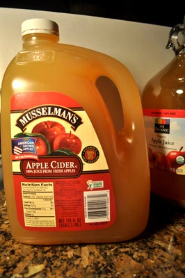
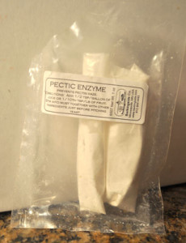
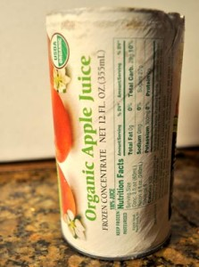
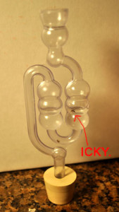

So you read everything you need to know about juice, yeast, sugar, alcohols, and sanitation… and now we are ready to make some hard cider! For those of you who cut-to-the-chase and did not really bother to read all the other information first, that is fine. Just don’t come crying to me when you end up with a gallon of vinegar in a month or take out your garage door with a batch of bottle bombs!

Wash your hands, dip them in [Star San](http://www.amazon.com/gp/product/B00E5MXGKK/ref=as_li_tl?ie=UTF8&camp=1789&creative=9325&creativeASIN=B00E5MXGKK&linkCode=as2&tag=howtomakeha07-20&linkId=CZWF62M4XPM75UIQ) for a minute, and let’s get started!

## Making ONE GALLON of hard cider, step by step

**Step 1.** Purchase one gallon of cider (apple juice). As overviewed in the [juice selection page](fruit-yeast.html), it will taste best if you can find cider from a orchard, farmer’s market or cider stand. It should be pasteurized, cold pasteurized (treated with UV light) or have a label that says UNPASTURIZED[\*](#footerwarning). If you are going to use grocery store (pasteurized) cider without preservatives, skip to step 3\. If you are using pasteurized grocery cider with added potassium sorbate or sodium chlorite, [click here](fruit-yeast.html).

Sadly, I do not have good access to local fresh cider, so I use Musselman’s or Whole Food’s 365 organic brand (labeled “apple juice”). Thanks to all of you who have offered to _mail_ me fresh cider to NW Arkansas. That is really awesome but way too expensive for you!

    

**Step 2.** For those of you using fresh cider mill cider, we need kill bacteria and to control wild yeast in your fresh cider. Crush [one Campden Tablet (potassium or sodium metabisulfite)](http://www.amazon.com/gp/product/B0064H0LHA/ref=as_li_tl?ie=UTF8&camp=1789&creative=9325&creativeASIN=B0064H0LHA&linkCode=as2&tag=howtomakeha07-20&linkId=BBD6TIUPAZUMJIMF)  
using a mortar and pestle, or put it in a ziplock bag and whack it with a hammer. Dissolve the crushed tab in 1 Tbsp very hot water. Add this to the gallon of juice. Fit a clean paper towel (or cheesecloth) over the top of your cider with a rubber band and wait at 48 hrs. This will inhibit all of the wild yeast in the cider, but **not** ‘sterilize’ the cider. (If your cider is unpasteurized, using campden tabs at this level will _potentially_ not kill all the bacteria that could be in the juice.) Shake a couple times a day to distribute the sulphur that is made by the campden tabs and allow it to escape out the top of your jug through the towel on top. If you are using grocery-store-bought cider there is no reason to use campden tabs. If you are having a go with wild yeast, leave out the campden tab, and cross your fingers! You wild thing, you.

**Step 3.** Make sure your cider is in a [GLASS one-gallon jug](http://amzn.to/2xySBfJ). ([\$8 for one](http://amzn.to/2xySBfJ) or only [\$6 if you buy four at a time](http://amzn.to/2ygzI4V)) If your cider is in a plastic jug, pour it into a clean and sterile glass jug for primary fermentation. If you use a funnel, remember to sterilize that too! If you purchased your cider in a glass jug (like the Whole Food’s 365 juice) just leave it in the jug it came in. Easy!

**Step 4.** If you are wanting your cider to sparkling clear, add a bit of [pectic enzyme](http://www.amazon.com/gp/product/B0064GZPWM/ref=as_li_tl?ie=UTF8&camp=1789&creative=9325&creativeASIN=B0064GZPWM&linkCode=as2&tag=howtomakeha07-20&linkId=JWNELYDWCSRS5OUY)  
according to the directions on the package. Be sure and sterilize your measuring spoon and use a clean paper towel to dry.

    

Adding pectic enzyme is not a necessary step and will only affect the look, not the taste of, your cider. Pectic, sometimes called ‘pectolytic’ enzyme breaks down pectin (a natural glue that holds plant cells together). Pectin is water-soluble, but it tends to fall out of solution and form clouds as alcohol content rises, so if you don’t use the enzyme, you might end up with a pretty good haze by the end of fermentation [[3](links.html)].  
Basically, pectic enzyme is cheap (powder or liquid is fine), so better safe than sorry in my book. So if you are going to the brew store, or placing an online order, [a bottle for \$5 will last for 40+ gallons of brewing](http://www.amazon.com/gp/product/B0064GZPWM/ref=as_li_tl?ie=UTF8&camp=1789&creative=9325&creativeASIN=B0064GZPWM&linkCode=as2&tag=howtomakeha07-20&linkId=JWNELYDWCSRS5OUY). If you opt not to use it, you might have a bit of murky looking brew that tastes just fine.

**Step 5.** Add some options to improve taste, body and increase the alcohol content–if you wish! Here is a list of optional additives, and also some suggestions on what not to add.

_Flavor tip one:_ Add 1/4 of a 12oz can of frozen apple juice concentrate. I add the frozen apple juice concentrate when I am using the grocery store apple cider, in an effort to make it more like the fresh stuff. Adding apple juice concentrate will increase the alcohol content (see more on [alcohol levels here](carb-oh.html)) and also make your cider a bit less watery (increases the viscosity). Adding frozen concentrate can also add a little more ‘apple’ flavor. If you are using fresh apple cider (from an orchard), you do not need to bother with adding the frozen apple juice concentrate, your cider is already thick and appley! If you do want to use the frozen concentrate, I recommend Cascadian Farms organic. You can also choose to add 1/4 cup of brown sugar if you don’t add the concentrate. For those of you with a hydrometer ([that amazing \$7 tool that measures sugar](http://www.amazon.com/gp/product/B000E60U6Y/ref=as_li_tl?ie=UTF8&camp=1789&creative=9325&creativeASIN=B000E60U6Y&linkCode=as2&tag=howtomakeha07-20&linkId=HCHY75SCCBFRWZBE)), check to make sure your PLAIN starting juice is around 1.045 – 1.050 S.G.. You don’t want to go below 1.045 S.G. because the final brew will not be stable. Add 2.25 oz of sugar to raise it .05 degrees until it is in this range. 1.050 S.G will give you a cider with an end result of around 6% alcohol. _**Note: For those of you making any more than “a test batch,” or more than one gallon at a time, please**_ [buy a hydrometer](http://www.amazon.com/gp/product/B000E60U6Y/ref=as_li_tl?ie=UTF8&camp=1789&creative=9325&creativeASIN=B000E60U6Y&linkCode=as2&tag=howtomakeha07-20&linkId=HCHY75SCCBFRWZBE) _**Note: ! A hydrometer is the only window we have into what is really happening with your brew.**_

    

*Flavor tip two:* Adding spices at this stage is NOT a good idea! Trust me, adding some nice apple-pie spices or a note of cherry at this point in the fermentation process is a BAD idea. (Again, note the voice of experience) Anytime I try to sneak any flavor in at this stage of fermentation, I end up with cider that tastes distinctly of gym socks. BLECH! My guess is that adventurous yeast eats (and alters) the spices too, along with the sugar. If you want some [extra apple notes (recommended)](http://www.amazon.com/gp/product/B004QXKQN8/ref=as_li_tl?ie=UTF8&camp=1789&creative=9325&creativeASIN=B004QXKQN8&linkCode=as2&tag=howtomakeha07-20&linkId=OAABVWE673ZZKCCB)  
or [cinnamon type flavors](http://www.amazon.com/gp/product/B00IDXSKVM/ref=as_li_tl?ie=UTF8&camp=1789&creative=390957&creativeASIN=B00IDXSKVM&linkCode=as2&tag=howtomakeha07-20&linkId=RB5D6TOPRQDOCHNX) add them _after_ fermentation is complete, and the yeast have stopped eating and altering. See more on [yeast here](fruit-yeast.html).

_Flavor tip three:_ Add 1/4 teaspoon [malic acid ( the natural acid that is in apples) or tannic acid (from grapes)](http://www.anrdoezrs.net/links/7281718/http://www.midwestsupplies.com/wine-tannin.html?utm_medium=affiliate&utm_source=commissionjunction). This gives the cider a bit more “complexity.” Traditional hard cider was made from apples that are so tart they are unfit for eating–think crab-apples. The sweet cider at the mill or store is usually just juice from sweet apples, so adding tannin or acids can give you more bite and old-fashioned cider flavor. I like to use this [Acid Blend (\$6)](http://www.amazon.com/gp/product/B006O1Z1YO/ref=as_li_tl?ie=UTF8&camp=1789&creative=390957&creativeASIN=B006O1Z1YO&linkCode=as2&tag=howtomakeha07-20&linkId=QPXMXSGZUEZRM5Q6)  
of both malic and tannic acid, or try whatever USP tannic acid, wine acid or grape tannin can be purchased from your brew store.

_Flavor tip four:_ Add 1/4 teaspoon [Yeast Nutrient (\$6)](http://www.amazon.com/gp/product/B0064H0MM4/ref=as_li_tl?ie=UTF8&camp=1789&creative=390957&creativeASIN=B0064H0MM4&linkCode=as2&tag=howtomakeha07-20&linkId=3ULLQY3WXSQM23BC). Again, this is sold at your brew store. Unlike grape juice, apple juice is deficient in a few nutrients that yeast needs to thrive. Adding some “Yeast Nutrient” (mostly B-vitamins) at this stage can help your little yeasty friends have a happy and thorough fermentation.

**Step 6.** Pitch your yeast. No, no, wait! Don’t toss the yeast in the trash! ‘Pitching’ is the term we use when we add the yeast to the juice. **If you are using 5g packet yeast from the brew store, you want to use 1/5 of the packet _per gallon of juice_.** A bit more or less should not matter. Sprinkle the yeast on top of the juice and let it rest. Check to make sure that there are no yeast grains stuck on the side around the top of the neck of the jug. If there are, gently swirl the juice to knock them off the side. _Don’t stir_. That is why it is called “pitching the yeast” and not “stirring in the yeast.”

**Step 7.** Add a clean and sterile stopper (also called a bung) to the top of the jug, and fit your ‘airlock’ into the top of the hole in the stopper. [The stopper size you want to purchase for a 1-gallon jug is a #6](http://www.anrdoezrs.net/links/7281718/http://www.midwestsupplies.com/rubber-stoppers-drilled.html?utm_medium=affiliate&utm_source=commissionjunction). If you order the stopper online, make sure to order one with a HOLE in it (drilled), as they also sell STOPPERS that are just plugs (voice of experience speaks again…) A stopper without a hole… is a cork!

Now you need an airlock (bubbler) [Set of 3, for \$6 ships free from Amazon](http://www.amazon.com/gp/product/B008ACWSZU/ref=as_li_tl?ie=UTF8&camp=1789&creative=9325&creativeASIN=B008ACWSZU&linkCode=as2&tag=howtomakeha07-20&linkId=6B2TDK5RTMSBAHJ2)  
(extras are not a bad idea…). Any airlock should work, and the plastic ones are only around a dollar or two. I like the function of the ones that have the “S” switchback (like in the photo) but there are many styles you can buy. I don’t like the ones with the center cylinder, as it sometimes leaks nasty water back in your brew. Eew.

    

In the side photo, you can see how important an airlock is to have. This ancient little device allows gases to escape as the yeast starts to ferment, but prevents air (and foreign contaminants, and icky fruit flies) from getting into your cider. The bubbling action of the airlock also gives you a good indication of the fermentation level. Bloop! Bloop! Bloop! You can hear your cider happily bubbling away. Some other resources on the Internet will tell you it is fine to use a balloon (or a balloon with a pinhole) on the top of your jug, and the balloon will expand with fermentation and then contract when it is over. This is really silly and sounds like a wonderful way to get some nasty balloon tasting brew. Please, just spend a buck on an [airlock](http://www.amazon.com/gp/product/B008ACWSZU/ref=as_li_tl?ie=UTF8&camp=1789&creative=9325&creativeASIN=B008ACWSZU&linkCode=as2&tag=howtomakeha07-20&linkId=6B2TDK5RTMSBAHJ2). It is not like the big brown truck can’t come to your house if you are in an area without a brew store.

Once the airlock is fitted on top of the stopper, use a drinking glass to pour a small amount of your [Star San](http://www.anrdoezrs.net/links/7281718/http://www.midwestsupplies.com/star-san.html?utm_medium=affiliate&utm_source=commissionjunctionhttp://www.midwestsupplies.com/star-san.html) water from sterilizing into the airlock reservoir. Fill to the level shown in the photo, about the middle of the middle bulbs on this S-style airlock. Don’t fill it too full, or it will spill out the top once the cider starts bubbling. You can also use vodka to fill your airlock if you have some to spare.

**Step 8.** Wait. Depending on the strain of yeast that you used ([Nottingham](http://www.anrdoezrs.net/links/7281718/http://www.midwestsupplies.com/lallemand-nottingham-ale-11-grams.html?utm_medium=affiliate&utm_source=commissionjunction) is slow), and the temperature of the room, you may have to wait up to 24-36 hours before you notice much bubbling. That said, you may see some bubbles going fairly well in about 6 hours if you added sugar or frozen concentrate and your room temp is around 72F (22.2C). If you have seen no bubble action in 48 hours, check to make double sure that your yeast is in-date and that your juice has no preservatives added. Slow is good. The cold room is good. The pros even will brew in a room around 55-60F (13-15.5C). I have a cool storage space that stays around 65F for my winter brewing.

**Step 9.** Enjoy listening to the bubbles – you are making hard cider! Once the yeast starts to feed, they also start to multiply. In 2 -3 days your cider should be bubbling like gangbusters! This should continue for about 5 days (again, depending on yeast and temperature) and then the bubbling should start to slow waaaay down. The yeast has multiplied like crazy and now there is nothing to eat! In addition, they have, uh, “released” a lot of alcohol as a waste product, and they will now be swimming in a fairly toxic soup. (Please make your own environmental connections here.) If you can’t resist helping out, for the first 4 days you may gently swirl the jug to help release some of the gas build up. This is fun because it causes a frenzy of bubbles. Do this gently, or you will end up with a geyser that fouls up your airlock (you would need to wash and re-sterilize the lock).

About 3 days before ‘racking’ (a.k.a. moving the cider to another jug), leave the cider alone and let the sediment all settle to the bottom. You will also want to move the jug up onto the shelf where you will be racking so that you do not have to move the cider and stir up the sediment when it comes time to rack. If this is a mystery, just read on!

**Step 10.** Here we come to the split in carbonation procedures. For a detailed overview of carbonation options please [read this page on Carbonation and Alcohol](https://howtomakehardcider.com/carbonation-and-alcohol/). If you don’t want all the details, no worries! Plow forward:

_Option one: “Almost exhausted carb.”_ If you are wanting to chance to guess about the carb levels and you are choosing the “almost exhausted carb” bottling method, jump to racking and bottling when the bubbles are fairly subsided. Do not add any sugar at bottling time. Adding flavor and sugar-alcohols are okay ([more about this on the next page](http://rack-bottle.html)).

_Option two: “Back Carbonation.”_ If you are wanting a controlled carbonation experience and are choosing the “back carbonation” method, you should WAIT until bubbling has nearly stopped and there are only little tiny bubbles around the surface of the neck of the jug. This should take about 3 to 3.5 weeks with ale yeast at around 60F/ 15.5C (those of you with a hydrometer, we are looking for 1.010 S.G). If you want to _control_ how dry or sweet your cider is, you should choose this method.

_Option three: “No Carbonation.”_ If you are wanting still cider, that will taste more like apple wine (but with about half the alcohol of wine), you should also wait until almost all the bubbles are stopped, as in option two.

Ready to move on? We are almost finished! Click to move on to the [Racking and Bottling page](https://howtomakehardcider.com/racking-and-bottling/).

Return to [top](#top)

_Text and images on this page by Jessica Shabatura._
